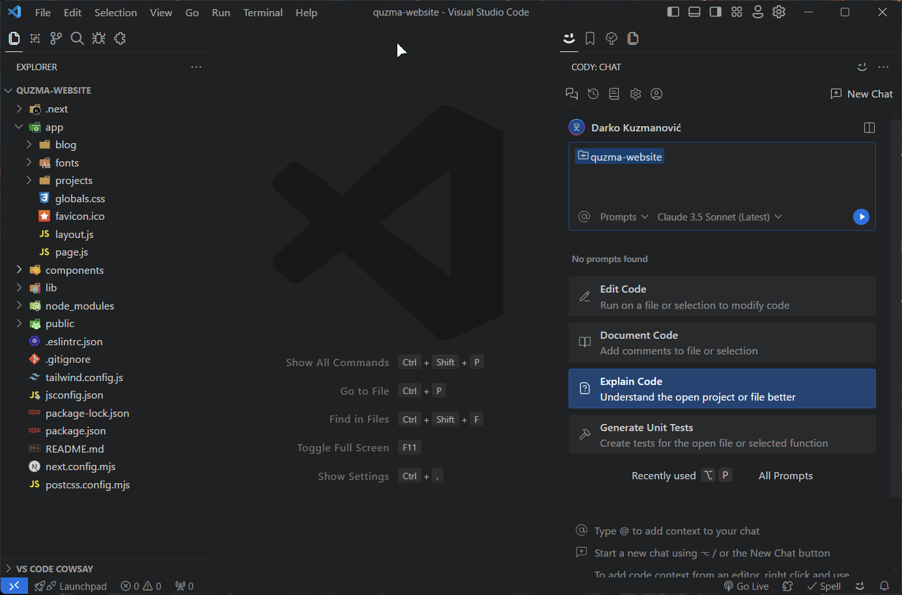

# CodyPromptPusher

CodyPromptPusher is a Visual Studio Code extension that enhances your workflow with Sourcegraph's Cody by allowing you to easily add files and folders to Cody Chat through the context menu.

## Features

- 🖱️ Right-click to add files to Cody Chat
- 📁 Support for recursive folder processing
- 📊 Progress tracking with detailed status updates
- ⚙️ Configurable file processing settings
- 🎯 Smart file exclusion patterns
- 📝 Multiple file selection support



## Installation

1. Download the VSIX file from the releases page
2. In VS Code, go to the Extensions view (Ctrl+Shift+X)
3. Click on the "..." menu at the top of the Extensions view
4. Select "Install from VSIX..." and choose the downloaded file

## Usage

### Adding Single or Multiple Files

1. Select one or more files in the VS Code Explorer
2. Right-click and select "Add to Cody Chat"
3. Files will be added to your current Cody Chat session

### Adding Entire Folders

1. Right-click on any folder in the VS Code Explorer
2. Select "Add to Cody Chat"
3. The extension will:
   - Scan the folder recursively for all files
   - Skip excluded patterns (e.g., node_modules)
   - Show progress while collecting and processing files

### Progress Tracking

- See real-time progress notifications
- View which file is currently being processed
- Cancel the operation at any time

## Configuration

Access settings through:

1. Command Palette (Ctrl+Shift+P)
2. Type "Preferences: Open Settings (UI)"
3. Search for "CodyPromptPusher"

Available settings:

```json
{
  // Delay between processing files (in milliseconds)
  "codyPromptPusher.delayBetweenFiles": 500,

  // Maximum number of files to process at once
  "codyPromptPusher.maxFilesAtOnce": 10,

  // Show notification for each processed file
  "codyPromptPusher.showNotifications": true,

  // Patterns to exclude when scanning folders
  "codyPromptPusher.excludePatterns": ["node_modules", ".git", "dist", "build", ".next", ".vscode"]
}
```

### Configuration Details

| Setting           | Description                                         | Default               |
| ----------------- | --------------------------------------------------- | --------------------- |
| delayBetweenFiles | Time to wait between processing files               | 500ms                 |
| maxFilesAtOnce    | Maximum number of files to process in one operation | 10                    |
| showNotifications | Show success notification for each file             | true                  |
| excludePatterns   | Patterns to skip when scanning folders              | ["node_modules", ...] |

## Requirements

- Visual Studio Code 1.60.0 or higher
- Sourcegraph Cody extension installed and configured

## Known Issues

- Large folders may take some time to scan
- Processing many files at once may impact performance

## Contributing

1. Fork the repository
2. Create your feature branch (`git checkout -b feature/amazing-feature`)
3. Commit your changes (`git commit -m 'Add amazing feature'`)
4. Push to the branch (`git push origin feature/amazing-feature`)
5. Open a Pull Request

## License

Distributed under the MIT License. See `LICENSE` file for more information.

## Credits

Developed by [Darko Kuzmanović](https://quz.ma)

## Release Notes

### 0.1.0

- Initial release
- Support for files and folders
- Configurable processing options
- Progress tracking
- Recursive folder scanning

---

**Note:** This extension is not officially affiliated with Sourcegraph or Cody.

## Support

For support, please:

1. Check the [FAQ](link-to-faq)
2. Search [existing issues](link-to-issues)
3. Create a new issue if needed
